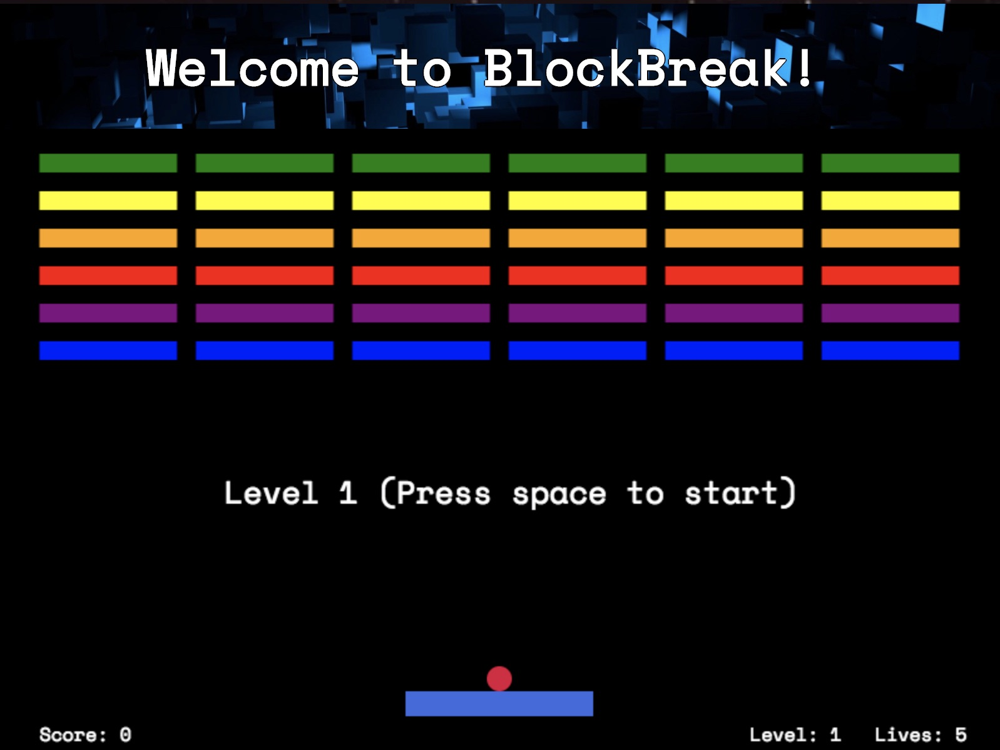

# BlockBreak
[Play here](https://mcgannco.github.io/BlockBreak/)


## Background
BlockBreak was inspired off of Atari's classic game Breakout. It was written in JavaScript and uses Canvas for 2D rendering and as well as jQuery for DOM manipulation.
## How to Play
Using a single ball, the player must knock down as many bricks as possible by using the walls and/or the paddle below to ricochet the ball against the bricks and eliminate them. If the player's paddle misses the ball's rebound, he or she will lose a life. The player has five lives to try to clear all of the bricks on each level.  For each brick hit, the player will receive a specific amount of points based on brick color and level. Ball speed increases at each level.  The goal of the game is to receive as many points as possible.

## Features
### 2D Rendering / Collisions
All 2D rendering is done using HTML 5 Canvas. Through each Canvas elements, I was able to detect all collisions between Paddle and Ball, Ball and Brick, and Ball and Wall

```javascript
  draw(ctx) {
    ctx.beginPath();
    ctx.fillStyle = this.color;
    ctx.fillRect(this.pos[0], this.pos[1], this.width, this.height);
    ctx.fill();
    ctx.closePath();
  }
```

```javascript
isCollidedWith(otherObj) {
  if(this.pos[1] + this.vel[1] > 450 - this.radius &&
  (this.pos[0] > otherObj.pos[0] && this.pos[0] < otherObj.pos[0] + otherObj.width)) {
    return true;
  }
}
```

### Paddle / Ball Movement

## Features to add
### Sound effects
